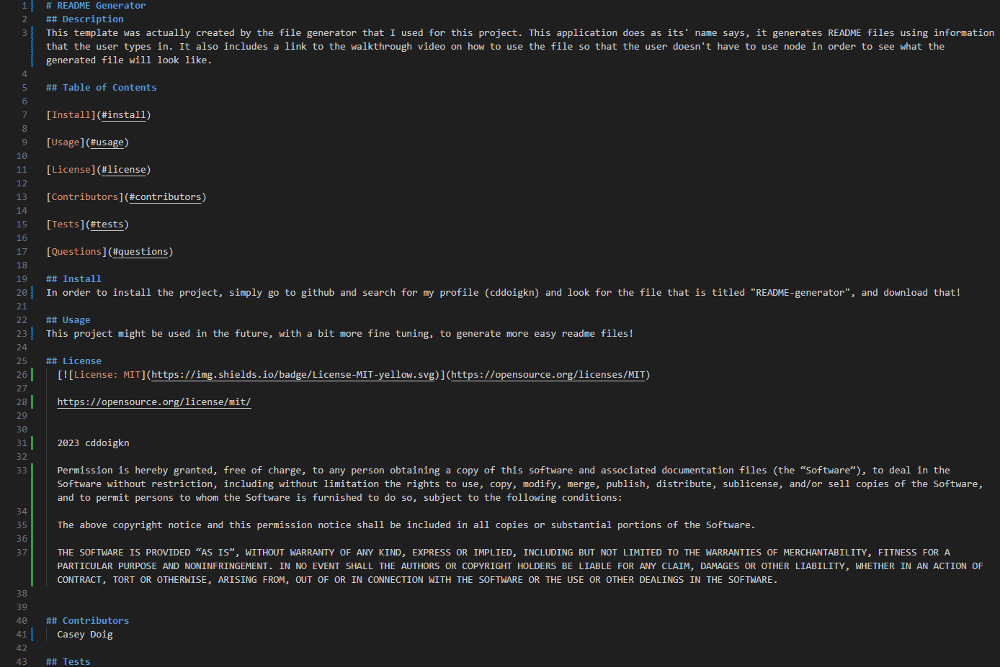

# README Generator
## Description
This template was actually created by the file generator that I used for this project. This application does as its' name says, it generates README files using information that the user types in. It also includes a link to the walkthrough video on how to use the file so that the user doesn't have to use node in order to see what the generated file will look like.

## Table of Contents

[Install](#install)

[Usage](#usage)

[License](#license)

[Contributors](#contributors)

[Tests](#tests)

[Questions](#questions)

## Install
In order to install the project, simply go to github and search for my profile (cddoigkn) and look for the file that is titled "README-generator", and download that!

## Usage
This project might be used in the future, with a bit more fine tuning, to generate more easy readme files!

## License
  
  
  https://opensource.org/license/mit/
  
  
  2023 cddoigkn
  
  Permission is hereby granted, free of charge, to any person obtaining a copy of this software and associated documentation files (the “Software”), to deal in the Software without restriction, including without limitation the rights to use, copy, modify, merge, publish, distribute, sublicense, and/or sell copies of the Software, and to permit persons to whom the Software is furnished to do so, subject to the following conditions:
  
  The above copyright notice and this permission notice shall be included in all copies or substantial portions of the Software.
  
  THE SOFTWARE IS PROVIDED “AS IS”, WITHOUT WARRANTY OF ANY KIND, EXPRESS OR IMPLIED, INCLUDING BUT NOT LIMITED TO THE WARRANTIES OF MERCHANTABILITY, FITNESS FOR A PARTICULAR PURPOSE AND NONINFRINGEMENT. IN NO EVENT SHALL THE AUTHORS OR COPYRIGHT HOLDERS BE LIABLE FOR ANY CLAIM, DAMAGES OR OTHER LIABILITY, WHETHER IN AN ACTION OF CONTRACT, TORT OR OTHERWISE, ARISING FROM, OUT OF OR IN CONNECTION WITH THE SOFTWARE OR THE USE OR OTHER DEALINGS IN THE SOFTWARE.
  

## Contributors
  Casey Doig

## Tests
  A plethora of tests were ran in order to see what would and what wouldn't work, those are listed in the amount of commits I made

## Questions
  https://github.com/cddoigkn
  
  https://github.com/cddoigkn/README-generator
  
  This is a screencast of the generator being used:
  https://drive.google.com/file/d/1sZCYHbjHwtbF0YaoafuCmcRosRL_w_G-/view
  
  
  
